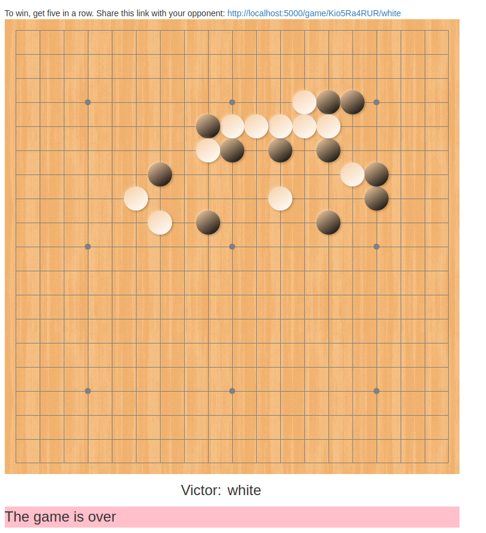

Hack-A-Day is a project I'm doing in November, where I try to make 30 new projects, in 30 days.

# Day 13: Hack-A-Line

This is a five-in-a-row game. Get five in a row vertically, horizontally, or diagonally to win. Play with a friend online. No registration.

Known bugs: display of pieces on the edges and corners is wrong.

Demo available [here](https://tilde.za3k.com/hackaday/line).

Source available on [github](https://github.com/za3k/day13_line).
